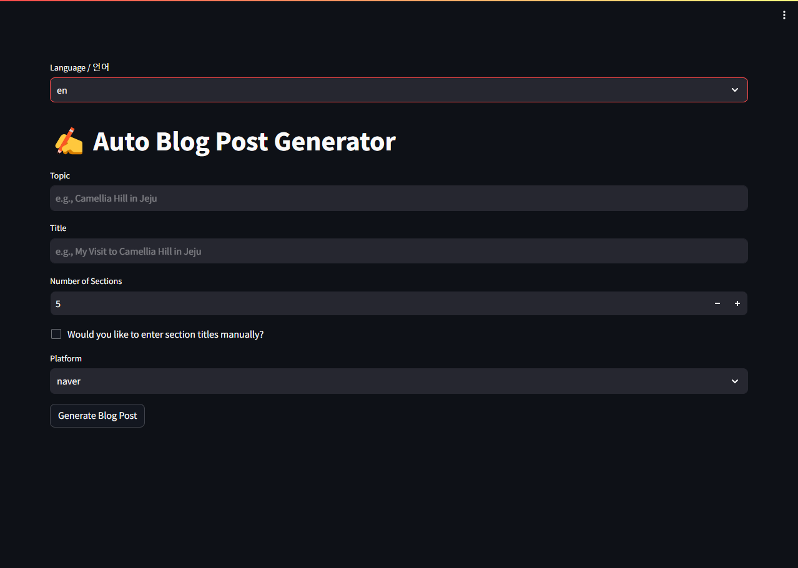

# blog-writer

## Current graph


## Current interface

| Korean | English |
| --- | --- |
|  |  |

## How to run

### Install dependencies

```bash
# Install python packages (with pip)
$ pip install -r requirements.txt

# Install python packages with poetry
$ pip install poetry
$ poetry install
```

### Run with streamlit

```bash
# Run with streamlit
$ streamlit run blog_writer/streamlit_app.py

# Run with streamlit (with poetry)
$ poetry run streamlit run blog_writer/streamlit_app.py --server.port 8501
```
