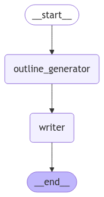
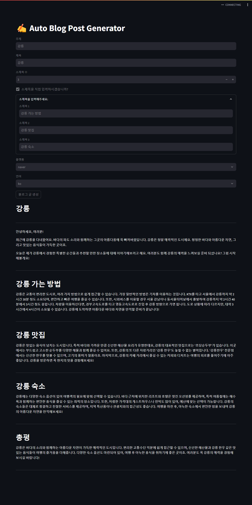

# blog-writer

## Current graph

## Current interface

## TODO

- [x] Create `OutlineGenerator` agent to generate outline.
- [ ] Create `Supervisor` agent to supervise the whole process for writing blog post.
- [x] Create `Writer` agent to write blog post.
- [ ] Create `ImageAnalyzer` agent to analyze images.
- [ ] Create `Poster` agent to post blog post to the platform.
- [ ] Expand platform support for scraping blog posts and posting blog post.
    - [ ] Naver Blog
    - [ ] Tistory
    - [ ] Wordpress
